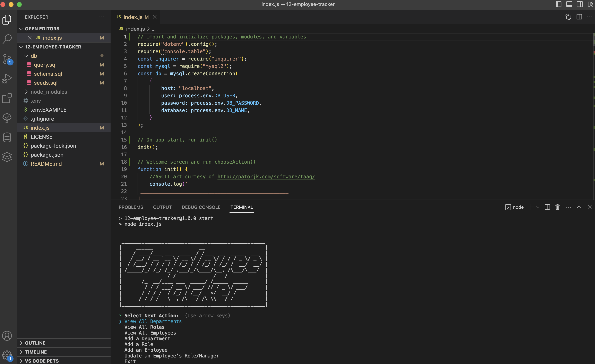

# 12: Employee Tracker     

## Description

A node.js and MySQL application to track a company's departments, roles, and employees from the command line based on user responses to inquirer prompts.  

  

## Table of Contents

- [Installation](#installation)
- [Usage](#usage)
- [License](#license)
- [Tests](#tests)
- [Credits](#credits)
- [How to Contribute](#how-to-contribute)
- [Questions](#questions)

## Installation
NOTE: Requires [Node.js](https://nodejs.org/en) and [MySQL](https://dev.mysql.com).
1. Clone the repo to your local machine.  
2. Create a `.env` file in the root directory with the database name, user, and password as defined in the included `.env.EXAMPLE` except replace user and password with your MySQL login.  
3. With the cloned location as the active directory, install the npm dependencies from terminal with the command: `npm i`.  
4. Start the MySQL Shell with the command: `mysql -u[user] -p`
    where `[user]` is your login. Provide the password when prompted.  
5. Initiate the database with the command: `SOURCE db/schema.sql`
6. Exit MySQL Shell with the command: `exit`

## Usage

With the cloned location as the active directory, run the application from terminal with the command `npm start`.  
Follow the prompts in the terminal to build, view, and update your company database by adding and editing departments, roles, and employees. Your information will saved in the SQL database, even after exiting the application. 

See [Walk-Thru Video](https://drive.google.com/file/d/1pcjgyx8OOwb26YbbLUksv2AGWSnZ3bZL/view) for a detailed walk-thru of using the application with sample seed data using VS Code's Integrated Terminal.

## License

This project is covered under the following license: MIT License  
Refer to LICENSE in the repo for additional details.

## Tests

N/A

## Credits

ASCII art curtesy of [patorjk.com](http://patorjk.com/software/taag/)
Seed names curtesy of [Benedict Cumberbatch Name Generator](https://benedictcumberbatchgenerator.tumblr.com)

## How to Contribute

[Contributor Covenant](https://www.contributor-covenant.org/)

## Questions

For questions or suggestions, contact:  
GitHub: [@aerostokes](https://github.com/aerostokes)  
Email: [rhonda@aerostokes.com](mailto:rhonda@aerostokes.com)